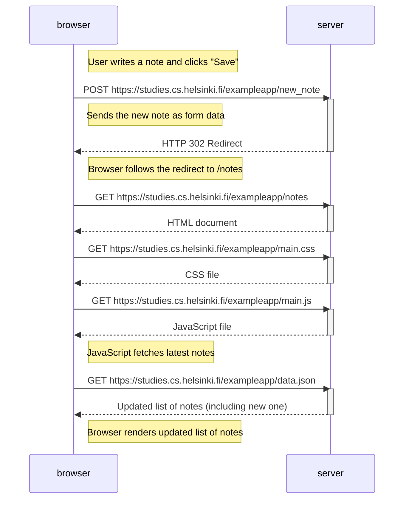

```mermaid

sequenceDiagram
    participant browser
    participant server

    Note right of browser: User writes a note and clicks "Save"

    browser->>server: POST https://studies.cs.helsinki.fi/exampleapp/new_note
    activate server
    Note right of browser: Sends the new note as form data
    server-->>browser: HTTP 302 Redirect
    deactivate server

    Note right of browser: Browser follows the redirect to /notes

    browser->>server: GET https://studies.cs.helsinki.fi/exampleapp/notes
    activate server
    server-->>browser: HTML document
    deactivate server

    browser->>server: GET https://studies.cs.helsinki.fi/exampleapp/main.css
    activate server
    server-->>browser: CSS file
    deactivate server

    browser->>server: GET https://studies.cs.helsinki.fi/exampleapp/main.js
    activate server
    server-->>browser: JavaScript file
    deactivate server

    Note right of browser: JavaScript fetches latest notes

    browser->>server: GET https://studies.cs.helsinki.fi/exampleapp/data.json
    activate server
    server-->>browser: Updated list of notes (including new one)
    deactivate server

    Note right of browser: Browser renders updated list of notes
```